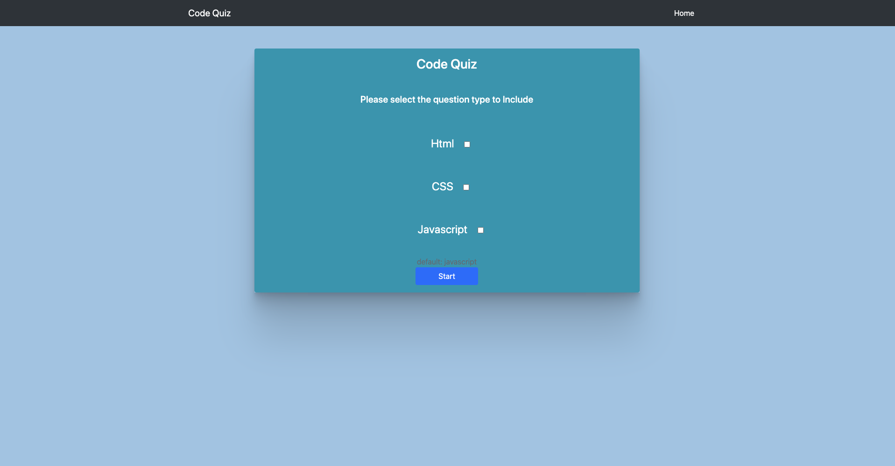

# code-quiz

This is a code quiz game, player is asked questions related to css/javascript/html. When the game loads the user will select what type of question to include in 
the quiz. After the selection, user starts the game. There is a timer in game which is set to 10seconds. Every wrong answer will reduce the timer by 2 seconds and every right answer will increase the time by 10seconds. After the game is complete, players can store their scores in the local storage. The score can be 0. 

[Go To the website](https://amitkarmacharya-edu.github.io/code-quiz/)

